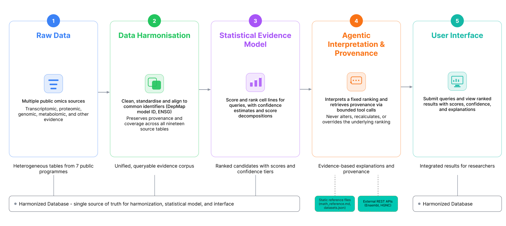

# GTAI CellLineSelector — Multi-Omics Cell-Line Selection and Evidence-Guided Ranking

**UoB-GeneTraceAI-25-26** · University of Bristol · 2025–2026

GeneTraceAI is a research system for selecting and ranking cell lines based on integrated multi-omics evidence — transcriptomic, proteomic, genomic alteration, and similarity data — rather than a single similarity metric. Recommendations are designed to be reproducible, auditable, and explainable.

> **Core question:** Which available cell line provides the strongest, most defensible biological model for a research question, given the available molecular evidence?

## Architecture



Scoring and ranking logic lives entirely in the backend pipeline — never in the frontend or the LLM. The LLM explains results grounded in pre-computed evidence; it does not generate rankings itself.

**Pipeline stages:** Harmonisation → Transcriptomics → Proteomics → Genomic Alterations → Scoring → Ranking → Evidence Ledger

## Repository Structure

| Path | Purpose |
|---|---|
| `architecture/` | Production pipeline: harmonisation, scoring, ranking, API |
| `Testing and validation/` | Tests, held-out evaluation, diagnostics, confidence intervals |
| `AIAgent/` | LLM research assistant (FastAPI + function calling) |
| `UI/cell-line-finder-react/` | React/Vite researcher interface |
| `EDA/`, `Cell Line Selector/` | Exploratory / original research work (legacy, not production) |
| `reference/` | Canonical gene and cell-line lookup tables |
| `research-evidence/` | Bibliography (`reference.bib`) |

**Note:** `architecture/` is the current production pipeline. `Cell Line Selector/` and `EDA/` are earlier research/exploratory work — use them for historical context only.

## Installation

```bash
git clone <repository-url>
cd UoB-GeneTraceAI-25-26

python3 -m venv .venv && source .venv/bin/activate
pip install -r architecture/requirements.txt
pip install -r AIAgent/requirement_agents.txt

cd UI/cell-line-finder-react && npm install && cd ../..
```

## Running the System

```bash
# 1. Build the warehouse (Stage 0 — see architecture/00_harmonisation/)
cd architecture

# 2. Run the production pipeline
python run_all.py

# 3. Start the API
uvicorn architecture.api.app:app --reload   # docs at /docs

# 4. Start the LLM agent
uvicorn AIAgent.api.app:app --reload

# 5. Start the frontend
cd UI/cell-line-finder-react && npm run dev
```

> Verify exact module paths/ports against `architecture/config.py` and the frontend's `BACKEND_INTEGRATION.md` — these may differ from the generic commands above.

## Testing & Validation

```bash
python "Testing and validation/Testing/run_tests.py"          # unit tests
python "Testing and validation/Validation/eval.py"            # held-out evaluation
```

Diagnostics (~50 scripts investigating rankings, data quality, edge cases) live in `Testing and validation/diagnostics/`. Monte Carlo confidence-interval and rank-stability analysis is in `Testing and validation/Confidence intervals/`.

## Docker

```bash
docker build -f architecture/Dockerfile -t genetraceai .
docker build -f AIAgent/Dockerfile -t genetraceai-agent .
```

## Documentation

- Methodology & scoring: `architecture/docs/`
- Agent details: `AIAgent/agent_api.md`, `AIAgent/agent_details.md`
- Frontend↔backend integration: `UI/cell-line-finder-react/BACKEND_INTEGRATION.md`
- Math/methods reference (used by the LLM agent): `AIAgent/Knowledge/math_reference.md`

## Troubleshooting

- **API can't find the database** → confirm `celllineselector.db` exists and check `architecture/config.py`.
- **Rankings differ between runs** → check data/config versions, random seeds, recent scoring changes; use `Testing and validation/Confidence intervals/` to assess stability.
- **Frontend can't reach API** → check the API is running, base URL, and CORS config.
- **Agent not responding** → check LLM credentials, env vars, and agent logs.

## Contributors

- Chaithali SK
- Musa Khumalo
- Thiruvel AP
- Triveni D


---

### Suggested next additions
- `docs/screenshots/` with UI screenshots (dashboard, ranking, evidence, agent) and a short demo GIF
- A configuration/env-vars table (DB paths, API URLs, LLM credentials)
- A data-sources table (dataset, modality, source, licence, pipeline entry point)
